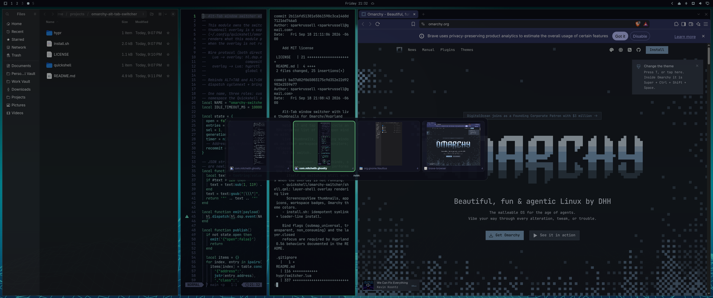
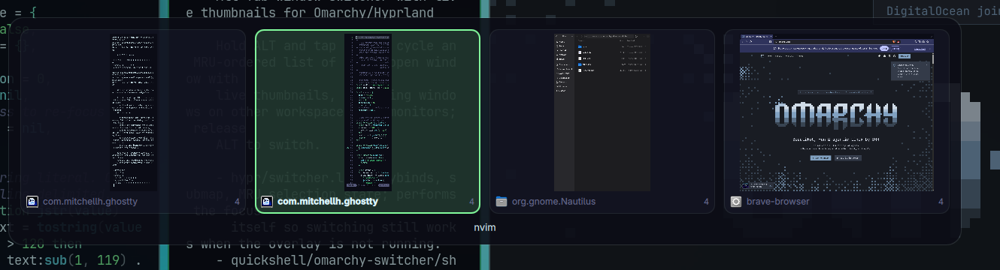

# omarchy-alt-tab-switcher

A hold-to-preview Alt-Tab window switcher for [Omarchy](https://omarchy.org/) /
Hyprland: hold `ALT`, tap `TAB` to cycle, and a centered card shows **live
thumbnails** of every open window — including windows on other workspaces and
other monitors. Release `ALT` to switch.

No new packages: the key handling is Hyprland's own Lua config API, and the
overlay is an Omarchy shell plugin ([Quickshell](https://quickshell.org/)) using
`ScreencopyView` against each window's Wayland toplevel.



Selection is highlighted with the theme's accent color; each cell carries the
app icon, its class, and the workspace it lives on, with the selected window's
title underneath:



## Requirements

- Hyprland 0.56+ with the Lua config (Omarchy's `~/.config/hypr/*.lua` layout)
- Quickshell 0.3+ (`quickshell` package; ships with Omarchy)

## Install

This is an [Omarchy shell plugin](https://plugins.omarchy.org/): the overlay
runs inside `omarchy-shell` as a service.

```bash
omarchy plugin add https://github.com/sparkrussell/omarchy-alt-tab-switcher.git --enable
```

Plugins can't register Hyprland keybinds, so add the key handling to
`~/.config/hypr/hyprland.lua` yourself. The existence check keeps your
Hyprland config loading if the plugin is later removed:

```lua
-- Alt-Tab window switcher (Omarchy plugin sparkrussell.alt-tab-switcher).
local alt_tab = os.getenv("HOME") .. "/.config/omarchy/plugins/sparkrussell.alt-tab-switcher/hypr/switcher.lua"
local alt_tab_file = io.open(alt_tab)
if alt_tab_file then
  alt_tab_file:close()
  dofile(alt_tab)
end
```

Then `hyprctl reload`. Update later with
`omarchy plugin update sparkrussell.alt-tab-switcher` (plus `hyprctl reload`
if `hypr/switcher.lua` changed).

## Keys

| Key | Action |
|---|---|
| `ALT + TAB` | Open the switcher / advance (first tap preselects the previous window) |
| `ALT + SHIFT + TAB` | Open backwards / step back |
| `ALT + →` / `ALT + ←` | Step forward / back |
| release `ALT`, or `RETURN` | Switch to the selected window |
| `ESC`, or `ALT + Q` | Cancel |
| mouse | Hover selects, click switches, click outside the card cancels |

Windows are ordered most-recently-used (Hyprland's `focus_history_id`), so a
quick `ALT+TAB` tap behaves like classic Alt-Tab. Hidden windows (e.g. swallowed
terminals) are skipped. An unattended switcher cancels itself after 10 s.

## Design

Two halves, talking over Hyprland's own IPC:

```
hypr/switcher.lua (Hyprland Lua)          Service.qml (omarchy-shell plugin)
  keybinds, submap, MRU list, selection       thumbnails, labels, theming
             |  hl.dsp.event("omarchy-switcher>>{json}")  ->  custom>> on socket2
             |  <-  hyprctl dispatch 'omarchy_switcher.pick("0x…")'
```

The Lua module is the single source of truth and performs the focus itself, so
**if the plugin is disabled, Alt-Tab still switches windows** — you
just lose the visuals.

Public Lua entry points (also usable from scripts or your own binds):

```bash
hyprctl dispatch 'omarchy_switcher.open(1)'      # open / advance
hyprctl dispatch 'omarchy_switcher.open(-1)'     # open backwards
hyprctl dispatch 'omarchy_switcher.step(1)'
hyprctl dispatch 'omarchy_switcher.commit()'
hyprctl dispatch 'omarchy_switcher.cancel()'
hyprctl dispatch 'omarchy_switcher.pick("0x55…")'
```

Theme colors are read live from
`~/.local/state/omarchy/current/theme/colors.toml`, so the card follows
`omarchy theme set`.

## Four Hyprland behaviors this works around

Verified against Hyprland v0.56.2 source; all four are why the bind flags look
the way they do.

1. **Release binds are matched against the submap that was active when the key
   went down** (`KeybindManager.cpp`, `submapAtPress`). `ALT` goes down before
   `ALT+TAB` enters the switcher submap, so a submap-scoped `Alt_L` release bind
   never matches — hence `submap_universal` plus a state check.
2. **`shadowKeybinds()` shadows every bind whose key is still held**, so
   triggering `ALT+TAB` shadows the `Alt_L` release bind. Only `global` and
   `transparent` binds are exempt — hence `transparent`.
3. **A consumed `ALT` release never reaches the focused client**, leaving apps
   believing `ALT` is stuck down — hence `non_consuming`.
4. **Hyprland refocuses a monitor's last window when a layer that held pointer
   focus unmaps** (`LayerSurface.cpp` `onUnmap`), which silently undid the
   switch. The target is therefore re-focused on the `layer.closed` event.

Also worth knowing: `hl.unbind` is not submap aware, so Omarchy's default
`ALT+TAB` binds must be removed *before* the submap registers its own; and
`HL.Timer` has no `stop()` — a oneshot is cancelled with `set_enabled(false)`.

## Uninstall

```bash
omarchy plugin remove sparkrussell.alt-tab-switcher
```

Then delete the Alt-Tab block from `~/.config/hypr/hyprland.lua` and run
`hyprctl reload`. Omarchy's stock `ALT+TAB` bindings come back on reload.

## License

MIT — see [LICENSE](LICENSE). Contributions and forks welcome.
